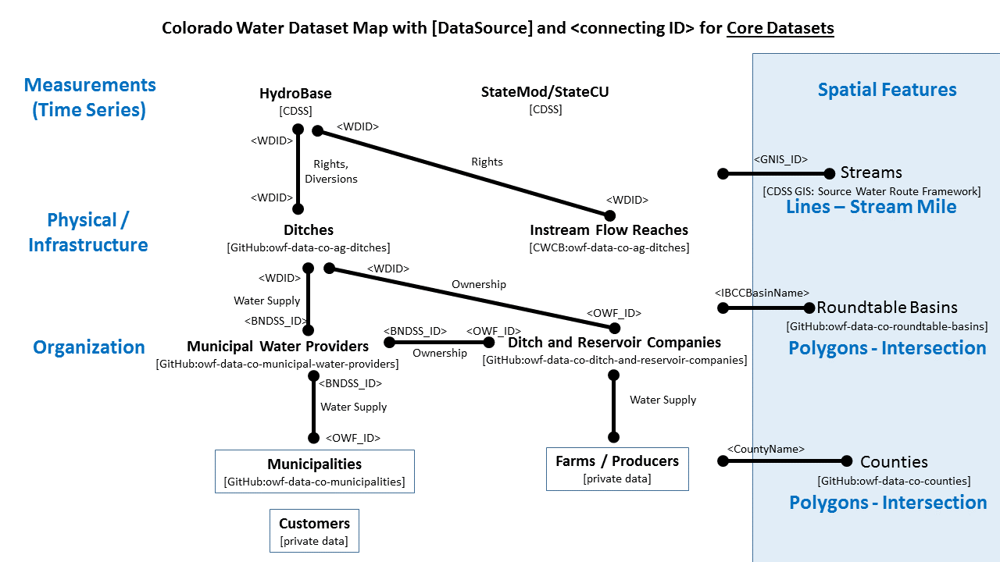
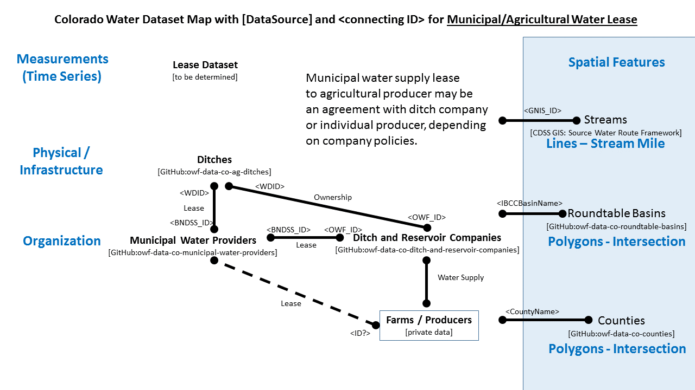
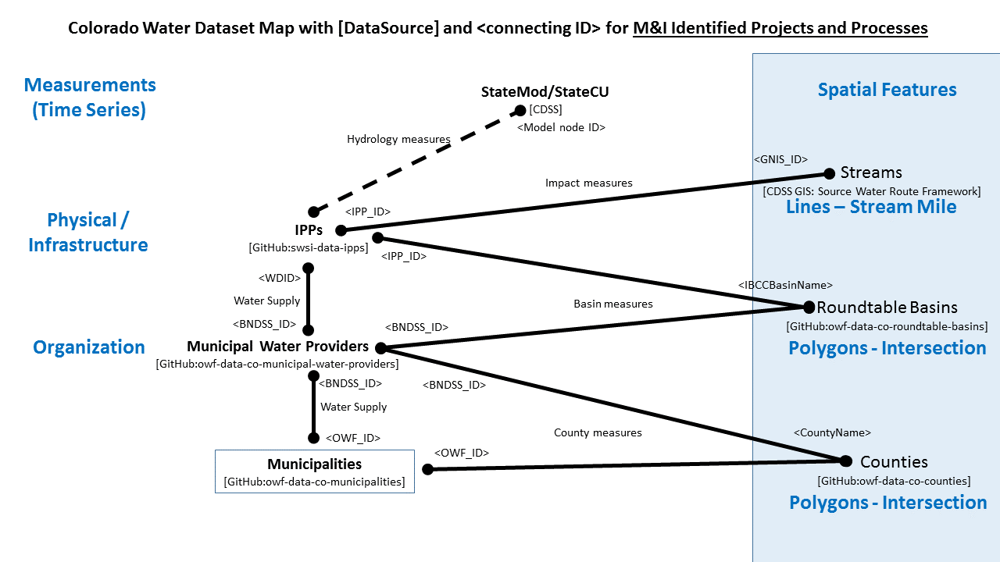

# South Platte Data Platform / Datasets #

The South Platte Data Platform project will improve access to important datasets and use the datasets
in visualizations and stories to help the South Platte and Metro Roundtables understand and explain water resources issues
in the South Platte Basin.
Many of the datasets will also scale to the entire state.
However, the project will initially focus on the geographic area of the South Platte Basin.

The remainder of this page includes the following sections:

* [Approach to Managing Datasets](#approach-to-managing-datasets)
* [Foundational Datasets](#foundational-datasets)
* [Linked Datasets](#linked-datasets)

-----------

## Approach to Managing Datasets ##

Extensive water resources data are available for Colorado.
However, the data are often difficult to find, understand, and access.
Raw data does not have meaning until it is viewed through a lens that provides context and perspective.
Primary outcomes of this project are to simplify access to data, and where appropriate, improve datasets so that they are easier to use.

In some cases, this project will simply refer to existing datasets.
In other cases, OWF is adding value to datasets, for example by cross-referencing datasets using unique identifiers
so that more complex data queries and visualizations can occur.
For example, the following images illustrate how foundational datasets are connected using identifier relationships
(right-click on image and view in new tab to view full-size).

Where OWF is "touching" data (rather than using an existing dataset),
the data will generally be maintained in a version-controlled, cloud-accessible repository, such as
[GitHub](https://github.com/).

Most datasets will exist as simple tables in Excel, which can be exported to comma-separated-value (CSV) format.
Some datasets will exist as map layers, with appropriate metadata and documentation.
Simple formats facilitate access and use.

Datasets are downloaded and processed into other data products and visualizations.
OWF will perform the analysis; however, the tools and processes are also published so that they
can be understood and enhanced by others.

Processed data and visualizations are then published to cloud-hosted locations such as
the OWF website and
[South Platte Basin Implementation Plan (soutplattebasin.com)](http://southplattebasin.com/).

Additional information will be added here as the project progresses.

## Foundational Datasets ##

Foundational datasets provide basic context and form the core of other datasets.
Published versions, including maps, will be made available as soon as possible.

| Dataset                                   | Description                                                                                                                                      | Link to Version-Controlled Copy                                                                       | Link to Published Dataset |
| ----------------------------------------- | ------------------------------------------------------------------------------------------------------------------------------------------------ | ----------------------------------------------------------------------------------------------------- | ------------------------- |
| owf-data-co-counties                      | OWF list of **Colorado counties**, with cross-referenced identifiers for other datasets.                                                         | [Dataset on GitHub](https://github.com/OpenWaterFoundation/owf-data-co-counties)                      |                           |
| owf-data-co-ditch-and-reservoir-companies | OWF list of **Colorado ditch and reservoir companies**, with cross-referenced identifiers for other datasets.                                    | [Dataset on GitHub](https://github.com/OpenWaterFoundation/owf-data-co-ditch-and-reservoir-companies) |                           |
| owf-data-co-municipalities                | OWF list of **Colorado municipalities**, with cross-referenced identifiers for other datasets.                                                   | [Dataset on GitHub](https://github.com/OpenWaterFoundation/owf-data-co-municipalities)                |                           |
| owf-data-co-municipal-water-providers     | OWF list of **Colorado municipal water providers**, with cross-referenced identifiers for other datasets.                                        | [Dataset on GitHub](https://github.com/OpenWaterFoundation/owf-data-co-municipal-water-providers)     |                           |
| owf-data-co-cwcb-water-providers          | OWF list of **Colorado water providers:  CWCB list with unique identifiers added** (**private dataset until distribution issues are resolved**). | [Dataset on GitHub](https://github.com/OpenWaterFoundation/owf-data-co-cwcb-water-providers)          |                           |
| swsi-data-ipps                            | SWSI list of **IPPs**, with cross-referenced identifiers for other datasets (**private dataset until distribution issues are resolved**).        | [Dataset on GitHub](https://github.com/OpenWaterFoundation/swsi-data-ipps)                            |                           |
| owf-data-co-roundtable-basins             | OWF list of **Colorado Roundtable basins**, with cross-referenced identifiers for other datasets.                                                | [Dataset on GitHub](https://github.com/OpenWaterFoundation/owf-data-co-roundtable-basins)             |                           |
| owf-data-co-watershed-groups              | OWF list of **Colorado watershed groups**, with cross-referenced identifiers for other datasets.                                                 | [Dataset on GitHub](https://github.com/OpenWaterFoundation/owf-data-co-watershed-groups)              |                           |

## Linked Datasets ##

Linked datasets will be created utilizing unique identifiers in different datasets and analyses.
Examples of linked datasets include:

* Using CDSS model datasets to provide simulation data
* Linking datasets from different government agencies
* Linking spatial and temporal datasets.
More information will be added here as foundational datasets are linked to provide additional insight.
