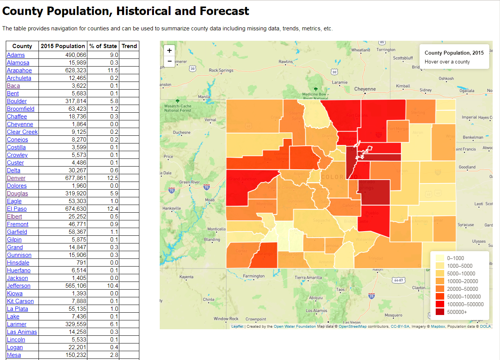
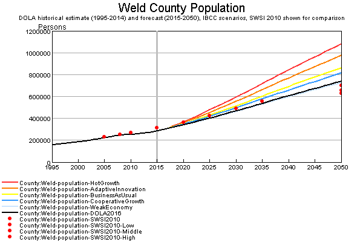
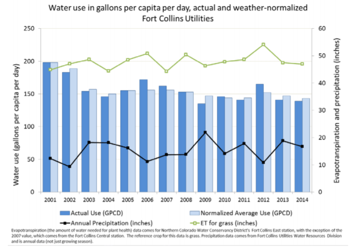
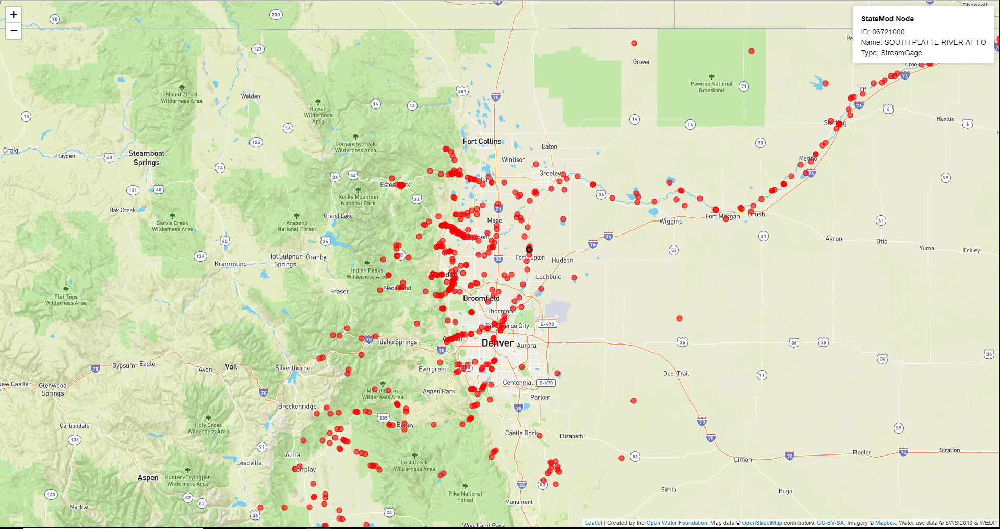
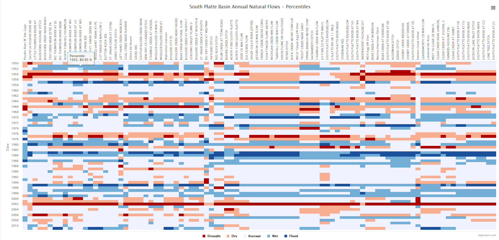
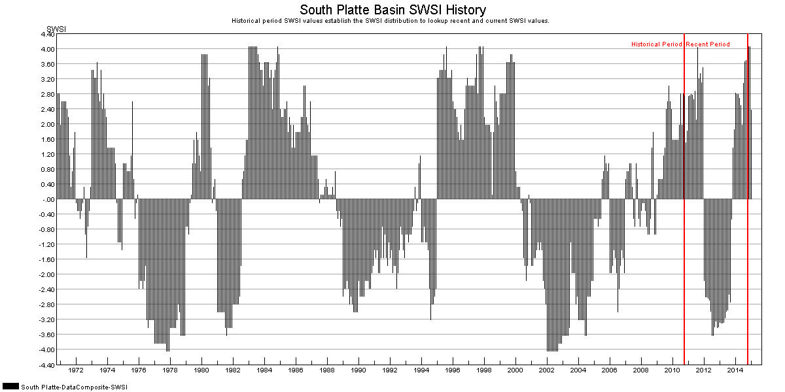
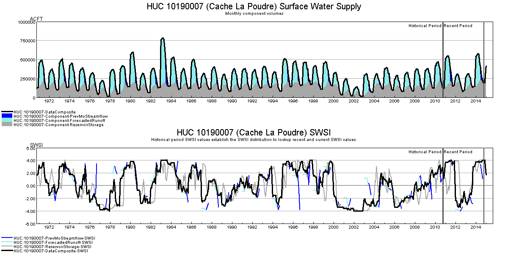
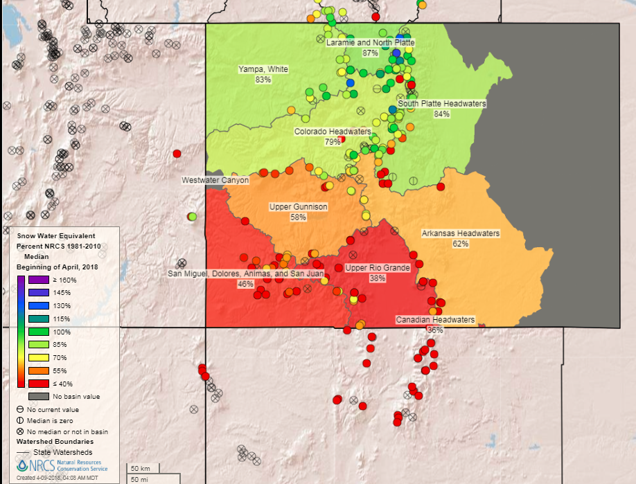
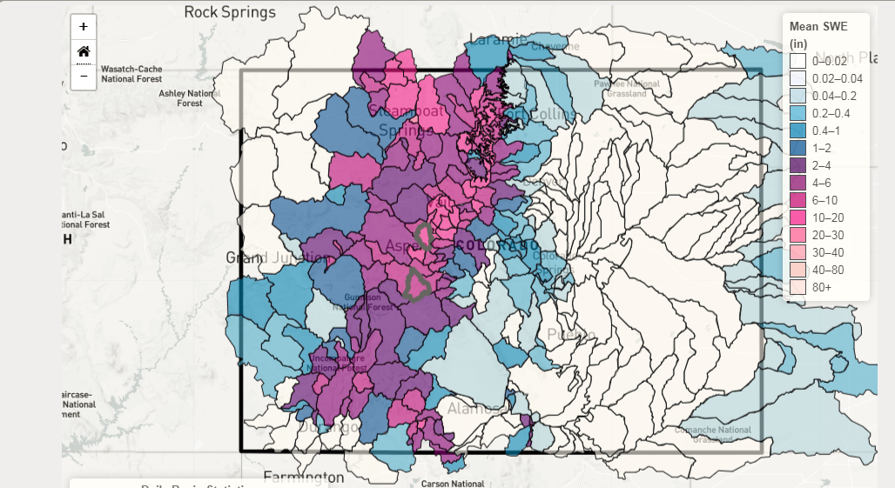
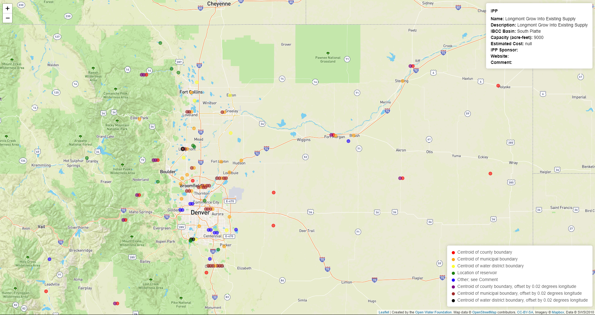

# South Platte Data Platform / Stories #

Stories within the South Platte Data Platform consist of multiple datasets and visualizations integrated in a way
that provides context and perspective, in order to educate and illustrate about water resource issues.
Stories are intended to integrate data and science with human connection in order to achieve greater understanding and dialogue.

* [Stories of Interest](#stories-of-interest)
* [Potential Technologies](#potential-technologies)
* [Stories Being Developed](#stories-being-developed)
	+ [Story: South Platte Water Entities](#story-south-platte-water-entities) - for context
	+ [Story: Population Trends and Water Use](#story-population-trends-and-water-use) - urban population increasing, rural not so much
	+ [Story: South Platte Hydrology and Need for Storage](#story-south-platte-hydrology-and-need-for-storage) - storage balances hydrologic variability
	+ [Story: South Platte IPP Locations](#story-south-platte-ipp-locations) - projects that address water supply needs

---------------

## Stories of Interest ##

Stories of interest to South Platte and Metro Roundtable stakeholders include the following,
which have been determined based on Roundtable input and correspondence.
These stories are being evaluated to focus on a subset that can be achieved with available data and other resources.
Current attention is focusing on [Stories Being Developed](#stories-being-developed).

1. Agricultural
	1. Story:  Return flows - significance in South Platte
		1. What happens to returns when agriculture gets more efficient?
		2. Extract data from [StateMod South Platte model](http://cdss.state.co.us/Modeling/Pages/SurfaceWaterStateMod.aspx)
		3. Use [Source Water Route Framework](http://cdss.state.co.us/GIS/Pages/AllGISData.aspx) for stream segments
		4. Also can link to [Visual South Platte](http://www.lspwcd.org/index_files/POINTFLOW2.htm)
		5. Display acreage served by sprinklers above a point on river?
		6. Display returns at points on river
		7. One or more case studies at specific locations showing change over time
		8. Visualize "water colors" such as natural flow, reservoir release, return flows
	2. Story:  Irrigated agriculture change over time
		1. [Animation of irrigated lands](http://viz.openwaterfoundation.org/co/co-irrigated-ag-animation/index.html)
		2. Agriculture peaked in 1970s and has been declining since
		3. Where is dry-up occurring?
	3. Story:  ATMs - adoption and effectiveness for addressing water supply gap
		1. Show locations on maps - need public ATM dataset from CWCB or someone else
		2. Link to studies, operations documents, etc. - need public ATM dataset from CWCB or someone else
2. Municipal
	1. Story:  Population historical trends and forecasts
		1. Locations of [municipalities](https://github.com/OpenWaterFoundation/owf-data-co-municipalities/blob/master/data/Colorado-Municipalities.geojson) and
		[municipal water providers](https://github.com/OpenWaterFoundation/owf-data-co-municipal-water-providers/blob/master/data/Colorado-Municipal-Water-Providers.geojson)
		2. Population historical trends by city, county
	2. Story:  Change in water use efficiency
		1. Links to websites, conservation/efficiency plans
		2. Highlight success stories (Denver Water, others)
		3. Use [HB 1051 data](http://cwcb.state.co.us/water-management/waterEfficiency/Pages/ReportingWaterUseWaterConservationData.aspx).
3. Environmental & Recreational
	1. Story:  River health
		1. OWF has been working on a [river health visualization tool - see Eagle River example](http://viz.openwaterfoundation.org/co/owf-viz-co-eagle-river-health-sunburst/)
		2. Need to grind some existing South Platte data into format used by this tool
	2. Story:  Duck Flyover recharge and habitat from same project
		1. Recharge locations - need project location data from DU or SWSI E&R results?
		2. Explain benefits for duck flyovers
		3. Explain trends - dependency on corn?
	3. Story:  Importance of recreation in the basin
		1. Map showing camping areas, other recreation - need from CPW
		2. Display dataset of
		[outfitters and stream reaches](https://github.com/OpenWaterFoundation/owf-data-co-river-outfitters/blob/master/data/Colorado-River-Outfitters.geojson) - need
		better public dataset from outfitters
4. Industrial
	1. Story: Largest use types
		1. Energy?
		2. [Breweries](https://github.com/OpenWaterFoundation/owf-data-co-breweries)?  Case study?
5. Story:  Projects to address water supply gap
	1. [Maps of IPP locations](https://github.com/OpenWaterFoundation/swsi-data-ipps) (private), and characteristics of IPPs
	2. Map showing master plan extent in river basins - could be difficult to get the spatial data
6. Other stories
	1. Story:  Change in water availability over past 40-50 years
		1. Extract data from [StateMod South Platte dataset](http://cdss.state.co.us/Modeling/Pages/SurfaceWaterStateMod.aspx)
		2. Display natural and available flow from model
		3. Display wet/dry/average years
		4. What is SWSI base supply scenario versus hydrology?
		5. Change in snowpack.  [See map](http://projects.openwaterfoundation.org/owf-proj-co-cwcb-2016-snodas/prototype/index.html).
		[See animation for water years](http://viz.openwaterfoundation.org/co/owf-viz-co-snodas-gapminder/).
		6. [Transbasin diversions?](https://github.com/OpenWaterFoundation/owf-data-co-transbasin-diversions)
	3. Story: Aquifer storage and recovery (ASR)
		1. What is story?

## Potential Technologies ##

The following are technologies that are being evaluated to implement stories.

* [ArcGIS Story Maps](https://storymaps.arcgis.com/en/)
* [Observable](https://beta.observablehq.com/?utm_source=blocks) - story notebooks based on [D3.js](https://d3js.org/)
* [Scrolling web application layout](https://startbootstrap.com/template-overviews/scrolling-nav/)

Considerations for using a specific technology include:

* Compatibility of solution with State of Colorado IT environment
* Hosting cost
* Ability to automate data uploads (so that story content can be updated over time)
* Implementation effort
* Integration with version control (so that content changes can be tracked)

## Stories Being Developed ##

The following stories are actively being developed on this project through the
efforts of the Open Water Foundation in coordination with South Platte and Metro education committee.

Stories consist of "panels", each of which contain one or more of the following elements:

* Narrative
* Image(s)
* Video
* Interactive maps
* Interactive data visualization(s)
* Links to other web resources such as data sites, visualizations, and in-depth resources.

Each "panel" can be used in a story, with appropriate narrative content.
Panels are typically organized in slideshow or book fashion,
using scrolling content, tabs, or other expandable content.
Technological limitations may impact how stories are constructed.
For example, it may be necessary to provide a screen image in a panel rather than live data visualization,
with link to the live visualization.

### Story: South Platte Water Entities ###

This story highlights the various types of water entities such as cities, agriculture, E&R uses.
The purpose of the story is to provide general context for the number, location, and
extent of such entities in the basin.

* Context:  Locations
* Context:  Relative water use
	+ by sector, time of year, trend
	+ biggest water users on average by municipality, ditch, crop type, etc.

#### Panel 1a - Municipalities Locations ####

**Narrative**:  Show the locations of municipalities to emphasize the locations on Front Range,
along rivers, and some isolated (groundwater supply).

* Context:  Map of municipalities using statewide dataset,
for example:  [Colorado Municipalities](https://github.com/OpenWaterFoundation/owf-data-co-municipalities/blob/master/data/Colorado-Municipalities.geojson)
* Context:  Can also use municipal boundaries such as [dataset on CIM](https://data.colorado.gov/Municipal/Municipal-Boundaries-in-Colorado/u943-ics6).
* Resources:  Links to useful information important to each entity such as conservation/efficiency plans,
planning data, drought restrictions, etc.
	+ For example, see [Denver Water Supply Data and Reports](https://www.denverwater.org/your-water/water-supply-and-planning/supply-data-and-reports)
	+ For example, see [Fort Collins Water Board Monthly Report](stories-images/WaterBoardMonthlyMemo_2018-01.pdf)
	+ How many major water providers have such information?

#### Panel 1b - Municipal Size and Growth ####

**Narrative**:  Show historical and expected population growth for municipalities (or counties),
which is cited as one of the main drivers for increasing water demands and the water supply gap.

* Context:  List and map of counties/municipalities sorted by population, percent of population in basin and state, for example.  <a href="../stories-images/county-population-map.png">See also full-size image.</a> 
* Details:  Graph and tables for each county/municipality showing historical and projected population from DOLA, perhaps also show SWSI Update scenarios - <a href="../stories-images/Weld-population-graph.png">See also full-size image</a> 
* Perspective:  Can also show that population is expected to decrease or increase much more slowly in some rural areas by showing map and/or table contrasting rural and urban areas
<a href="../stories-images/Washington-population-graph.png">See also full-size image.</a> 

#### Panel 1c - Water Use ####

**Narrative**:  Summarize information about municipal water use.

* Background:  How is water use defined?  Diversion/depletion, consumptive, wastewater return, indoor/outdoor, etc.
* Context:  Which municipalities use the most water?  Show a table showing recent data, total and system GPCD.
	+ For example, show GPCD for major provider using public data, such as Fort Collins.  <a href="../stories-images/FortCollins-GPCD-graph.png">See also full-size image.</a> 
* Context:  Water use and relative amount of flow for nearby stream gage, such as percent of annual amount or monthly flow.
* Context:  Change in efficiency of water use over time.
* Context:  Comparison of urban and agricultural water use
* Data:  1051 data, published data from entities
* Data:  Can we get machine-readable data for a few entities from published annual reports, etc?
For example, can we get the Excel workbook with data corresponding to annual report and/or Water Efficiency Plan?

#### Panel 2N - Agricultural Sector ####

**Narrative**:  Show general data for agricultural sector.

* Context:  List ditches, with links to websites if available.
* Context:  Irrigated lands and ditch service area maps, using CDSS data layers.
* Context:  Can show diversions and/or consumptive use sorted.
* Context:  Can show [change in irrigated acreage over time](http://viz.openwaterfoundation.org/co/co-irrigated-ag-animation/index.html),
also with graph showing trends across the basin.
* Context:  Could show change in irrigation practice over time such as flood, sprinkler, surface water, groundwater supply.

#### Panel 3N - Environmental Sector ####

**Narrative**:  Provide context to indicate value of environment, challenges, and opportunities.

* Context:  Display relevant environmental layers from SWSI, if available.
* Context:  Show instream flow reaches from CWCB.
* Context:  Show map of watershed groups, if available, such as [Colorado Watershed Assembly, Watershed Group Directory](http://www.coloradowater.org/colorado-watershed-basins-map/).

#### Panel 4N - Recreational Sector ####

**Narrative**:  Provide context to indicate that recreation is important in the South Platte 

* Context:  Display recreation map layers from SWSI, if available.
* Context:  Show camping locations, etc. (if layers are available from CPW).
* Context:  Show recreational outfitters, etc. (if layers are available).
* Resources:  Map attributes can provide links to outfitters.

#### Panel N+ - Other Sectors ####

**Narrative**:  Show data for other sectors such as additional industries.

### Story: Population Trends and Water Use ###

This story highlights population trends in each county (possibly cities).

* See information in the previous story - need to decide to what degree the stories overlap/share.

### Story: South Platte Hydrology and Need for Storage ###

This story highlights hydrologic variability, its challenges, and need for reservoirs to manage water supply across variable hydrologic conditions.

#### Panel 1 - River Locations from StateMod and Stream Gages ####

**Narrative**:  These are locations where streamflow is either measured or simulated.
Natural flows are the estimated streamflow with human impacts removed.
For example, diversions are added back to the river and reservoir releases are removed.
<a href="../stories-images/statemod-nodes.png">See also the full-size image.</a>

#### Panel 2 - Hydrologic Variability Illustrated with Annual Natural Flows ####

**Narrative**:  Annual estimated natural flows at gages throughout the basin can be ranked
and evaluated for frequency, such as "drought", "dry", "average", "wet", and "flood",
as shown in the following figure. This illustrates that the basin experiences
periods of drought and abundant supply.
<a href="../stories-images/natural-flows-percentiles.png">See also the full-size image.</a>
Note:

* The South Platte CDSS model did not include the Poudre so need to explain how natural flows are impacted by this.
* Although there is some variability across the basin, conditions tend to be similar across the basin within a year.
* Wet and dry periods often occur in groups.
* Note the severity of 2002, which was the trigger for major changes in Colorado, including
IBCC, Statewide Water Supply Initiative, etc.
* The annual water demand in a year can exceed the natural supply.

#### Panel 3 - Hydrologic Variability Illustrated with Measured Flows ####

**Narrative**:  Do the same thing with measured/simulated flows.

#### Panel 4 - Surface Water Supply Index ####

**Narrative**:  Water supply can also be viewed as an index, such as -4 for extreme
drought and +4 for abundant supply.  An index uses multiple inputs to create an indicator of water supply.
The following image shows the monthly Surface Water Supply Index (SWSI) for South Platte,
which considers resevoir storage, snowpack, and streamflow.
Note 2002.
<a href="../stories-images/south-platte-swsi-history-graph.png">See also the full-size image.</a>

Below is a detailed SWSI (index) graph for the Poudre.  Note 2002.
<a href="../stories-images/HUC-10190007-SWSI-history-graph.png">See also the full-size image.</a>

#### Panel 5 - Snowpack - 1-year Storage ####

**Narrative**:  Snowpack is Colorado's main water supply, and is essentially a one-year storage reservoir.
It has the benefit of being natural, high elevation, and generally high-quality supply.
However, it suffers from hydrologic variability and will be impacted by climate change.
The following is [SNOTEL data](https://www.wcc.nrcs.usda.gov/webmap_beta/#version=90&elements=&networks=!&states=!&counties=!&hucs=&minElevation=&maxElevation=&elementSelectType=all&activeOnly=true&activeForecastPointsOnly=false&hucLabels=true&hucIdLabels=false&hucParameterLabels=true&stationLabels=&overlays=&hucOverlays=wy_8,state&basinOpacity=70&basinNoDataOpacity=100&basemapOpacity=90&mode=data&openSections=parameter,date,basin,options,elements,location,overlays,labels&controlsOpen=true&popup=&popupMulti=&base=esriWsr&displayType=basinstation&basinType=co_8&dataElement=WTEQ&parameter=PCTMED&frequency=MONTHLY&duration=I&customDuration=&dayPart=E&year=2018&month=4&day=8&monthPart=B&forecastPubMonth=4&forecastPubDay=1&forecastExceedance=50&seqColor=1&divColor=1&scaleType=C&scaleMin=40&scaleMax=160&referencePeriodType=POR&referenceBegin=1981&referenceEnd=2010&minimumYears=20&hucAssociations=true&lat=38.598&lon=-104.224&zoom=7.0), which is available for specific locations.
<a href="../stories-images/snotel.png">See also the full-size image.</a>

The following is [SNODAS data](http://snodas.cdss.state.co.us/app/index.html), which is available for the entire State.
<a href="../stories-images/snodas.png">See also the full-size image.</a>

#### Panel 6 - Surface Reservoir Storage - Multi-year Storage ####

**Narrative**:  Surface reservoir storage is the most cost-effective storage, although costs are increasing.
Reservoirs created on mountain streams and rivers allow gravity to be used to move water supplies.
Need to include image showing reservoir storage over time during drought period.

#### Panel 7 - Alluvial Aquifer Storage - Short and Long-term Storage ####

**Narrative**:  Describe how the alluvial aquifer is used to manage supplies within the irrigation season,
recharge, etc.

#### Panel 8 - Reservoir Operations can Increase Value of Storage ####

**Narrative**:  Describe how reservoirs can be operated for greater benefit, such as in series,
exchanges, redundancy, historical operations, opportunities.

### Story: South Platte IPP Locations ###

This story focuses on helping Roundtable members understand the status of IPPs.

There is general interest among Roundtable members in knowing more about "Identified Projects and Processes (IPPs)".
A list of IPPs was created for the Statewide Water Supply Initiative 2004 project and has been updated over time. 
However, updates to data have been minimal through SWSI updates and Basin Implementation Plan projects.
IPPs are indicated in BIP and Colorado Water Plan as a major contributor to meeting new water supply demands.

There is interest from Roundtable members in knowing the status of old IPPs and whether the current list accurately
represents all IPPs.
There are also process questions, such as whether a WSRF or other grant project needs to be
included on the basin's IPP list before being allowed to request funding.

#### Panel 1 - IPP Definition ####

**Narrative**:  Explain what an IPP is so that the remainder of the story makes sense.

* What is the historical and current definition?  What needs to be explained given the current status of IPP data?
* Explain important concepts such as IPP type, "growth into existing supply", "yield/capacity",
how "mature" does an IPP need to be to be on the list, etc.

#### Panel 2 - IPP Map and List ####

**Narrative**:  Show the general location of IPPs to provide spatial context.

* South Platte/Metro IPP data have not traditionally had a simple "general location" or other location.
This is partially due to large IPPs having complex source/destinations, not a simple location.
OWF has estimated locations to allow creating a map but additional work needs to be done, such as in the SWSI Update project.
* See an initial version of the IPP map.  <a href="../stories-images/IPP-map-screenshot_3.png">See also full-size image.</a> 
